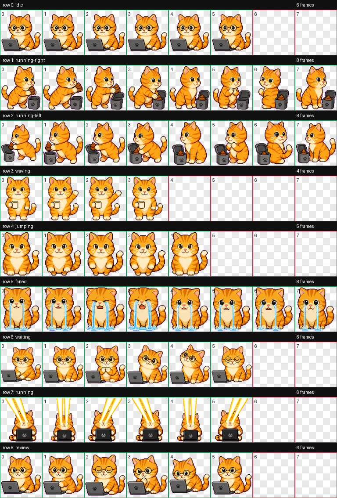

# 行云老师天天开心

一个 Codex 桌宠：像素风橘猫，包含工作、移动、喝咖啡、跳跃、哭泣、等待和激光眼动画。



## 安装

1. 下载仓库中的 [`xingyun-laoshi-v10.zip`](xingyun-laoshi-v10.zip) 并解压。
2. 将解压后的 `xingyun-laoshi-v10` 文件夹复制到：

   ```text
   %USERPROFILE%\.codex\pets\
   ```

3. 重启 Codex。
4. 在桌宠选择中启用 **行云老师天天开心 v10**。

最终目录应为：

```text
%USERPROFILE%\.codex\pets\xingyun-laoshi-v10\
  pet.json
  spritesheet.webp
```

## 动画预览

### 空闲工作


### 激光眼


## 文件说明

- `pet.json`：桌宠配置。
- `spritesheet.webp`：Codex 使用的完整动画图集。
- `contact-sheet.png`：九种状态总览。
- `row0-preview.gif`：空闲动画预览。
- `row7-preview.gif`：激光眼动画预览。
